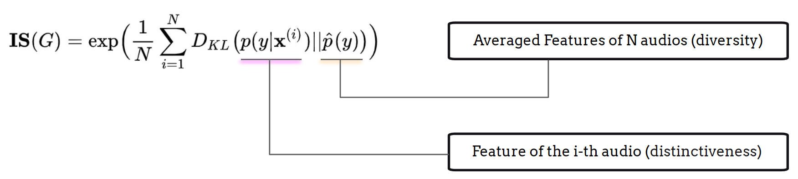

# 评估

我们在讨论模型架构之前先介绍**评估**，因为在生成任务中，理解用于评估多样性、整体质量、相关性以及音乐生成性能其他方面的客观指标至关重要。此外，认识到这些客观指标的局限性并用主观评估方法加以补充是非常有价值的，因为音乐生成的最终评判依赖于**聆听**而非数字。

## 主观听觉测试

主观听觉测试是评估音乐生成模型性能的最有效方法。借鉴语音生成中使用的技术，音频生成主观听觉测试中常用的两种方法是 Mean Opinion Score (MOS，平均意见评分) {cite}`DBLP:conf/icassp/GriffinL83` 和 MUSHRA (Multiple Stimuli with Hidden Reference and Anchor，带隐藏参考和锚点的多刺激测试) {cite}`mushra`。这些方法为了解听众感知和生成音乐的整体质量提供了有价值的见解。

### MOS 测试（Mean Opinion Score，平均意见评分）

MOS 测试的目的是评估**单个音频刺激**的整体质量。该方法已被广泛应用于文本转语音生成任务，以及电信和音频编解码系统中。MOS 测试的设置成本低且操作简便，测试者根据其对音频质量或其他特定标准的感知，在1（差）到5（优秀）的量表上对每个音频刺激进行评分。

MOS 测试的优势之一在于它适用于需要评估单个音频作品整体主观质量的场景，而非比较不同的模型或系统。然而，其不足之处在于反馈对音频刺激之间细微质量差异的敏感度较低，且无法提供评分背后原因的深入见解。

### MUSHRA 测试（Multiple Stimuli with Hidden Reference and Anchor，带隐藏参考和锚点的多刺激测试）

与 MOS 测试不同，MUSHRA 测试被认为是对多个音频刺激和系统进行详细评估的更高级方法。

MUSHRA 的设置要求测试者聆听同一音频信号的多个版本，包括一个高质量参考（隐藏参考）和一个低质量版本（锚点）。测试者根据感知到的音频质量，在0（差）到100（优秀）的连续量表上对每个刺激进行评分。MUSHRA 测试通常用于评估不同的模型消融实验，尤其是当差异较为细微时。

MUSHRA 的优势在于能够对音频刺激和不同模型之间的质量差异提供更详细和敏感的评估。参考和锚点的加入有助于确保参与者给出更准确的反馈。然而，MUSHRA 的一个显著不足是其设计复杂性；与 MOS 测试相比，它更为繁琐且耗时。此外，由于参与者通常需要在 MUSHRA 测试中对每个音频样本评估多个刺激，这可能导致长时间测试中产生疲劳。

## 音频多样性与质量

除主观听觉测试外，研究人员还从统计学习的角度开发了多种客观指标来评估生成性能。这些指标最初源于图像生成任务，包括 Inception Score (IS) {cite}`DBLP:conf/nips/SalimansGZCRCC16` 和 Fréchet Inception Distance (FID) {cite}`DBLP:conf/nips/HeuselRUNH17`。

### Inception Score

Inception Score (IS) 旨在评估生成模型输出的多样性和独特性。计算 Inception Score 需要一个表征模型，如 VGGish {cite}`DBLP:conf/nips/HeuselRUNH17`、PANN {cite}`DBLP:journals/taslp/KongCIWWP20` 或 CLAP {cite}`wu2023large`，用于创建有效的嵌入表示。计算过程可概括为以下步骤：

1. 使用预训练的表征模型为每个生成输出获取深度神经嵌入；
2. 计算所有生成输出的平均嵌入；
3. 使用 Kullback-Leibler (KL) 散度计算 Inception Score：

KL 散度的第一项代表嵌入分布的熵，是分类结果的有效指标。高 IS 表明每个嵌入都是独特的，因为表征模型能够自信地为每个生成输出分配一个唯一的标签。

第二项反映了嵌入的均匀性。当 IS 较高时，这表明生成输出期望覆盖所有可能类型的音频，呈现出均匀的分布。

### Fréchet Inception Distance (FID/FAD)

Fréchet Inception Distance (FID) {cite}`DBLP:conf/nips/HeuselRUNH17`，在音频领域被改编为 Fréchet Audio Distance (FAD) {cite}`DBLP:conf/interspeech/KilgourZRS19`，提供了一个基于 Inception Score 的可比较结果。计算过程可概括为以下步骤：

1. 使用预训练的表征模型为生成输出和**参考集中的数据点**获取深度神经嵌入；
2. 计算所有生成输出的平均嵌入、参考数据的平均嵌入、所有生成输出的协方差矩阵以及参考数据的协方差矩阵；
3. 然后使用这些值计算 FID/FAD：

IS 和 FID/FAD 之间的关键区别在于：IS 评估生成输出的分布，而 FID/FAD 将该分布与真实数据的分布进行比较，从而提供更全面的生成质量度量。

## 文本相关性

在文本到音乐生成任务中，评估生成输出与参考文本输入之间的对应关系对于评价多模态学习和生成性能至关重要。CLAP Score {cite}`wu2023large` 是该目的常用的指标，它利用了对比语言-音频预训练模块：

1. 使用预训练的 CLAP 模型分别获取生成音频和参考文本的嵌入；
2. 计算每个文本-音频对的点积或余弦相似度，并取平均值得到最终的 CLAP 分数。

此外，生成音频嵌入与参考音频嵌入之间的余弦相似度也可用于评估生成模型的音频质量和多样性。该指标可以整合到 IS 和 FID/FAD 分数的计算中。

## 局限性

IS、FID/FAD 和 CLAP 分数的局限性可以概括为三个关键方面：

1. 嵌入有效性：所有分数完全依赖于所使用的表征模型的有效性。因此，选择合适且有效的表征模型来计算嵌入至关重要。此外，了解这些模型的局限性有助于识别潜在的边界情况。

2. 分布层面的匹配：IS 和 FID/FAD 基于生成输出分布与平均输出或参考数据之间的散度。高分通常表示更优的质量和多样性，但如果模型能够"欺骗"评估，则可能产生误导。反之，低分并不一定意味着质量或多样性差；生成输出的分布可能只是偏向参考分布，而这仍可能反映良好的质量。

鉴于这些局限性，强烈建议在评估音乐生成模型时结合使用主观和客观指标。

