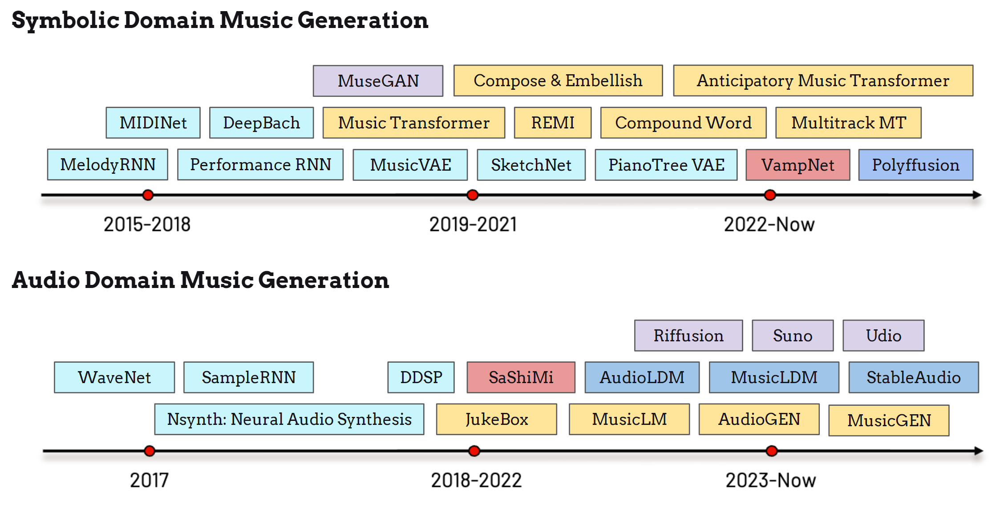

# 简介

## 历史

音乐生成的历史可以追溯到20世纪70年代 {cite}`hiller1979emc`，最初以算法作曲（algorithmic composition）的形式出现。到了20世纪90年代，研究人员开始将神经网络应用于符号音乐生成 {cite}`todd1989aca`。与此同时，实时交互艺术创作也开始融入音乐伴奏，将生成式音乐与动态艺术表达相结合 {cite}`rovan1997igms`。

如上方时间线所示，自2015年以来，深度学习模型在符号音乐和音频域音乐生成领域的探索迅速增长。
Google的研究人员将循环神经网络（RNN）应用于旋律生成，将旋律音符编码为音高和时值的离散状态，从而实现预测建模 {cite}`performancernn2017`。
MidiNet {cite}`DBLP:conf/ismir/YangCY17` 和 Performance RNN 进一步提升了生成模型的表现力，增强了生成音乐中的演奏技法和表现性。
Sony CSL 的 DeepBach {cite}`DBLP:conf/icml/HadjeresPN17` 实现了特定作曲家风格的迁移，能够生成巴赫风格的合唱曲。
深度生成模型的突破很快催生了三个重要的符号音乐生成模型，分别是 MuseGAN {cite}`DBLP:conf/aaai/DongHYY18`、Music Transformer {cite}`DBLP:conf/iclr/HuangVUSHSDHDE19` 和 MusicVAE {cite}`DBLP:conf/icml/RobertsERHE18`，它们几乎在2018年至2020年间同时出现。
这些架构为后续专注于更高质量、更高效率和更强可控性的模型奠定了基础，如 REMI {cite}`DBLP:conf/mm/HuangY20`、SketchNet {cite}`DBLP:conf/ismir/0021WBD20`、PianotreeVAE {cite}`DBLP:conf/ismir/0008ZZJYXZ20`、Multitrack Music Transformer {cite}`DBLP:conf/icassp/DongCDMB23` 等。

近年来，diffusion model（扩散模型）{cite}`ho2020denoising` 和 masked generative model（掩码生成模型）{cite}`DBLP:conf/cvpr/ChangZJLF22` 的发展为符号音乐生成引入了新的范式。Polyfussion {cite}`DBLP:conf/ismir/MinJXZ23` 等模型拓展了这一领域的可能性，并激发了更多创新。此外，Anticipatory Music Transformer {cite}`DBLP:journals/tmlr/ThickstunHDL24` 利用语言模型架构，在广泛的符号音乐生成任务中取得了令人瞩目的表现。

与符号音乐领域相比，音频域的音乐生成——即直接生成音乐信号——最初由于数据限制、模型架构约束和计算瓶颈，在生成质量方面面临诸多挑战。
早期的音频生成研究主要集中在语音领域，代表性模型包括 WaveNet {cite}`DBLP:conf/ssw/OordDZSVGKSK16` 和 SampleRNN {cite}`DBLP:conf/iclr/MehriKGKJSCB17`。Google Magenta 开发的 Nsynth {cite}`DBLP:conf/icml/EngelRRDNES17` 是首个合成音乐信号的项目，后来演变为 DDSP {cite}`engel2020ddsp`。OpenAI 推出了 JukeBox {cite}`DBLP:journals/corr/abs-2005-00341`，无需依赖符号音符的合成工具，直接从模型生成音乐。SaShiMi {cite}`DBLP:conf/icml/GoelGDR22` 将结构化状态空间模型（S4）应用于音乐生成。

最近，latent diffusion model（潜在扩散模型）已被应用于音频生成，AudioLDM {cite}`DBLP:conf/icml/LiuCYMLM0P23`、MusicLDM {cite}`chen2023musicldm`、Riffusion {cite}`riffusion` 和 StableAudio {cite}`stableaudio` 等模型处于领先地位。语言模型架构也在推动该领域的进步，AudioGen {cite}`DBLP:conf/iclr/KreukSPSDCPTA23`、MusicLM {cite}`agostinelli2023musiclm`、VampNet {cite}`garcia2023vampnet` 和 MusicGen {cite}`copet2024simple` 等模型不断涌现。文本到音乐生成（text-to-music generation）已成为热门话题，特别是在生成式和多模态学习任务中，Suno {cite}`suno` 和 Udio {cite}`udio` 等初创公司也在推动这一领域的发展。

在本教程中，我们重点关注音频域的音乐生成任务，特别是文本到音乐生成。这种方法与传统的基于信号的音乐理解和音乐检索任务紧密相关，并且自然地与语言处理相结合，架起了音乐与自然语言输入之间的桥梁。

## 问题定义

文本到音乐生成的概念如上图所示，模型通过训练学习一个概率函数，将给定的文本输入映射到音乐输出。图中包含了可能的文本描述示例：简单的描述可能由流派、情感、乐器或用途等关键词组成。更复杂的输入可以是传达详细音乐信息的完整句子，例如乐器分配（粉色）、调号和拍号（蓝色和绿色）以及"固定套路"（黄色）。模型的目标是准确编码这些文本线索，并将其反映在生成的音乐输出中。

在接下来的章节中，我们将首先介绍音乐生成的评估方法。然后，我们将详细讲解两种代表性的文本到音乐模型：基于自回归语言模型的架构（MusicGen {cite}`copet2024simple`）和基于非自回归扩散模型的架构（StableAudio {cite}`stableaudio`）。最后，我们将探讨文本到音乐模型的一些指导原则和当前局限性，旨在增强机器生成音乐与人类创造力之间的互动。
