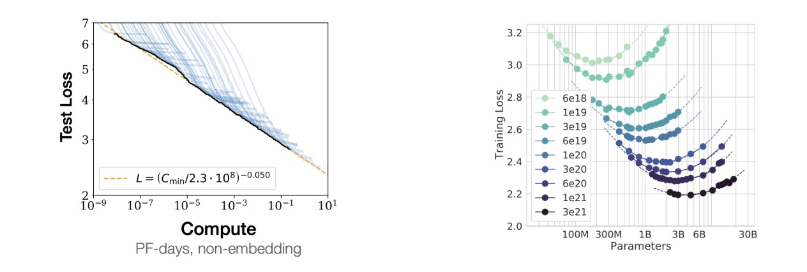
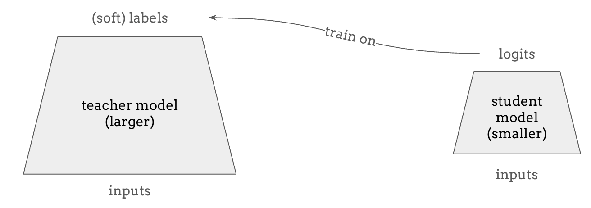
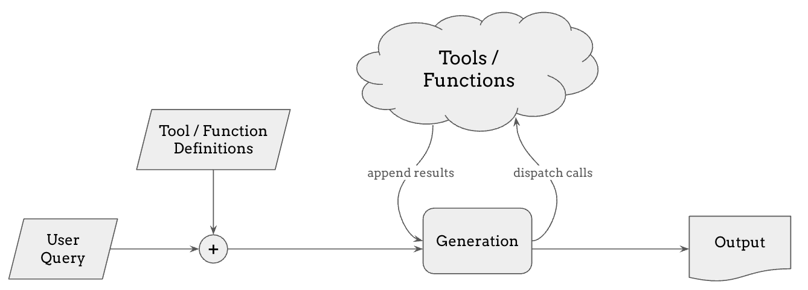

# 研究进展

在上一节中，我们介绍了语言建模作为一个强大的机器学习框架，用于学习任意输入和输出之间的映射：

在本节中，我们将指出使用该框架时的一些局限性及其解决方案。

### 局限性

虽然这个框架非常强大，但在实践中，它当然也有各种局限性。下表列出了其中一些局限性以及该领域是如何应对的。

| 局限性 | 因此难以…… | 但我们可以…… | 解决方案
|:---------:|:---------:|:---------:|:---------:|
| 它是生成模型 | 用于判别任务 | 使用探针或在每个任务上 fine-tuning | 迁移学习 |
| 它生成无意义内容 | 使用该模型 | 使用更多数据/更大的 Transformer | 扩展（Scaling） |
| 现在它太大太慢了 | 快速且低成本地生成 | 从大模型蒸馏出小模型 | 蒸馏（Distillation） |
| 它的行为不符合期望 | 用作有用的助手 | 根据人类偏好进行 fine-tuning | 后训练（Post-Training）/ RLHF |
| 它的上下文有限 | 处理更大的搜索空间 | 从外部来源查询更多上下文 | RAG / 工具使用 / Function Calling |
| 多模态数据量巨大 | 难以作为条件输入 | 使用编码器，如 CLIP 和 Whisper | 多模态编码器 |
| 输出必须是离散的 | 采样连续数据 | 使用 VQ-VAE 和/或扩散模型 | 多模态解码器 |
| 每个 token 的计算量恒定 | 在需要时进行更深层的思考 | 让模型逐步思考 | Chain-of-Thought 推理 |

如你所见，每一个局限性都引出了围绕语言模型的一整个研究领域。下面，我将简要介绍这些主题及相关的研究进展。

##### 从语言模型进行迁移学习

一旦我们有了一个训练好的语言模型，它能给出 token 的概率分布，我们可以采样一些文本来使用它，但其他类型的任务呢，比如分类这样的判别任务？这就引出了**迁移学习（Transfer Learning）**。

我们用来训练语言模型的任务，如下一个 token 预测或填空，被称为 **pretext task（前置任务）**，意思是这些任务本身不一定是最终目标，但对于学习语言的通用表示非常有用。
因此，以这种方式训练的语言模型不仅可以为给定的前缀生成续写内容，还学习了大量关于语言结构、模式和语义的知识，我们可以加以利用。

为此，我们可以用一个任务特定的"头"替换模型的最后一层，复用模型的基础部分。这个头会针对特定任务进行 fine-tuning，而基础模型本身可以根据任务和可用数据量的不同，选择更新或冻结。

这种迁移学习过程使我们能够利用模型学习到的表示，并灵活地将其应用于广泛的任务，通常只需要少量的任务特定数据。

##### 零样本任务迁移和 In-Context Learning

当我们拥有一个足够强大的生成模型时，不一定需要对每个特定任务进行 fine-tuning。我们可以简单地用任务描述来提示（prompt）生成式语言模型——比如 `translate English to German:` 或 `summarize this paragraph`，模型会基于其已有的知识生成回复。

这种方法被称为零样本任务迁移（zero-shot task transfer），它允许我们完全跳过 fine-tuning 阶段，在无需额外训练的情况下将模型用于各种文本到文本的任务。
分类或回归任务也可以被格式化为文本到文本的任务，例如在 prompt 中列出所有选项并加上 `A.` `B.` `C.` `D.` 的前缀，让模型续写对应正确答案的字母。

我们还可以直接在 prompt 中提供几个当前任务的示例，使模型进入解决该特定任务的模式。例如，我们可以提供几对英法翻译对，帮助模型识别任务模式并提供更好的翻译。这被称为 **few-shot learning（少样本学习）**，因为模型可以仅从少量任务特定的训练数据中快速适应。而这种直接从 prompt 中学习任务、完全无需 fine-tuning 的能力被称为 **in-context learning（上下文学习）**。

这些认识是随着语言模型规模的扩大而逐渐形成的——从 GPT-2 的超过十亿参数，到 T5 的超过一百亿参数，再到 GPT-3 的超过一千亿参数——由此普及了 large language model（大语言模型）或 LLM 这一术语。为什么这些能力会随着模型规模的扩大而"涌现"？

##### 语言模型的 Scaling Law

对于为什么某些涌现能力会在特定规模出现，我们还没有完美的答案，但这些发展引出了一个重要概念：语言模型的 Scaling Law（缩放定律）。

神经网络可以通过增加更多的层、通道或参数来扩展，这通常意味着更好的性能。研究人员通过实验发现，增加训练所用的计算量对降低损失有可预测的效果。本质上，通过扩大计算资源，我们可以实现更低的错误率和更好的泛化能力。

左图展示了随着计算预算的增加，测试损失持续下降，其帕累托前沿在对数-对数图上是一条直线，这表明存在幂律关系。

来自 Chinchilla 论文的第二张图显示，对于固定的计算预算，存在一个最优的模型大小和数据集大小能够实现最低的损失。在 LLM 术语中，这个大小被称为 Chinchilla-optimal。

上面的图表只涉及训练计算量，但在实践中，推理可能需要大量额外的计算资源，因为模型在训练一次后可以被数百万用户使用。因此，语言模型通常会训练远超 Chinchilla-optimal 点的时长，因为一个能达到相同性能的更小模型可以节省大量推理计算成本，即使训练成本更高。

##### 语言模型的蒸馏

如上所述，扩大语言模型规模通常是有益的，但在实践中我们需要更小的模型来获得更快的推理速度和更低的成本。
**知识蒸馏（Knowledge Distillation）**是一种很有前景的方法，可以获得一个小的"学生"模型，其表现与大的"教师"模型一样好。
这之所以可能，是因为教师模型可以提供比训练数据更丰富的监督信号，例如预测时所有可能 token 的 logits，而不仅仅是训练数据所能提供的离散独热（one-hot）标签。

近年来，蒸馏这个术语也指在更"智能"或更大模型的输出上进行训练的过程，因为这些模型的输出质量足够高、数量足够大。一个很好的例子是对特定任务从 GPT-4o 模型的输出进行蒸馏，客户可以在这些输出上训练一个 GPT-4o mini 模型，从而在使用该模型完成特定任务时节省成本。

##### 用人类反馈对齐语言模型

由于自回归语言模型只是被训练来生成续写内容，它并不总是遵循我们的意图。例如，如果我们用一个问题来提示模型，它可能会回答这个问题，也可能继续生成一堆相关的问题。

我们之前讨论了 few-shot learning 作为一种补救措施，即在 prompt 中提供几个遵循期望行为的示例，
但让模型按照我们期望的方式行动，一种更有效的方法是在 InstructGPT 论文中提出的 **RLHF**，即**基于人类反馈的强化学习（Reinforcement Learning from Human Feedback）**。
这是一个分三步对预训练语言模型进行 fine-tuning 以使其与期望行为对齐的过程。

- **第一步：监督微调（Supervised Fine-Tuning, SFT）** —— 首先，我们收集演示数据。例如，我们可以请人类标注者为特定 prompt 生成回复，向模型展示期望的输出行为。然后使用这些监督数据对模型进行 fine-tuning，从而创建一个大致反映人类偏好的基准模型。
- **第二步：奖励建模（Reward Modeling, RM）** —— 然后，我们通过向人类标注者展示同一 prompt 的多个模型输出并请他们从好到差排序来收集比较数据。这些数据用于训练一个独立的奖励模型，该模型能评估模型输出并提供奖励分数，表明输出与人类偏好的匹配程度。
- **第三步：近端策略优化（Proximal Policy Optimization, PPO）** —— 我们使用强化学习，具体来说是 Proximal Policy Optimization，基于上一步训练的奖励模型来调整模型的行为，使其输出的奖励最大化。

RLHF 的核心思想是将语言模型不仅视为文本续写模型，而是视为强化学习中的一个策略（policy），它经历一个多步马尔可夫决策过程，在每一步生成一个 token，最终根据整个回复的质量获得奖励信号。
其直觉是，与仅进行优化下一个 token 预测准确性的监督微调相比，这个过程允许模型更全面地被微调以匹配人类偏好。

一种更新的方法叫做 **DPO（Direct Preference Optimization，直接偏好优化）**，它是 RLHF 的替代方法，不涉及强化学习，但优化的目标与 RLHF 在数学上等价。DPO 被用于 LLaMA 2 和 LLaMA 3 的 fine-tuning。

这个整体过程被称为**后训练（post-training）**，因为它发生在基础模型的预训练之后、语言模型作为产品发布之前——产品要求模型与人类偏好对齐。

##### 检索增强生成（Retrieval-Augmented Generation, RAG）

使用语言模型的另一个挑战是，它们只能基于训练数据生成回复，这意味着它们可能缺乏最新的或专业的信息。
为了解决这个问题，我们可以在 prompt 中包含新的相关信息，正如我们在讨论 few-shot learning 和 in-context learning 时提到的，但语言模型的上下文长度是有限的。

这就是 **RAG（检索增强生成）**作为一种强大方法发挥作用的地方。
RAG 使模型能够从外部来源搜索相关信息——例如知识库、最新的新闻文章或公司的内部数据库——并将这些信息纳入其回复中，即使这些信息不在训练数据集中。

其工作流程如下：

1.	用户提交查询，首先由检索器处理。
2.	检索器在知识库或数据库中搜索最相关的信息。这个检索步骤可以使用多种方法，如 embedding 相似度或全文搜索，来找到最佳匹配。
3.	检索到的信息随后被添加到模型的上下文中，使生成步骤能够基于查询和检索到的信息生成有据可依的回复。

RAG 可以减少模型产生幻觉（即生成不准确信息）的倾向，也使其更容易正确引用输出来源，而纯 LLM 生成通常在这方面表现不佳。
RAG 的性能受限于检索系统的准确性和延迟，因此与纯 LLM 生成相比，要让系统的每个组件都准确工作变得更具挑战性。

##### 工具使用和 Function Calling

工具使用和 function calling 是 RAG 的自然延伸。
虽然 RAG 允许模型检索相关信息，但某些任务需要实时数据、精确计算或超出检索范围的专门功能。
通过工具使用和 function calling，语言模型可以动态调用外部工具——如计算器、网络搜索、代码解释器或 API——来增强其回复。

当用户提交查询时，模型可以决定是否需要调用特定工具，这取决于它是否采样到了一个指示应该使用工具或调用函数的特殊 token。
如果是，它会向相关工具发送调用，获取结果，并将其整合到回复中。
这种能力使模型能够超越静态知识，还能通过执行代码或调用 API 来对外部世界进行更改。

在 ChatGPT 或 Claude 中，你可以让它执行自己生成的代码并展示结果，或者更近期地，你可以让 LLM 控制一台虚拟桌面计算机并使用它来执行任务。
这催生了 LLM agent（智能体）这一新兴领域，而让多个智能体相互交互并实现复杂目标仍然是一个开放的挑战。

##### 用于语言模型输入的多模态编码器

为了将图像或音频数据纳入语言模型，我们可以使用多模态编码器。

其思想是将图像或音频 embedding 而不仅仅是词 embedding 馈送到模型中。
编码器可以是任何类型的，从监督学习、自监督学习到对比学习模型，只要它能为该模态提供良好的表示即可。
常见的选择是从公开可用的预训练模型中挑选，例如用于图像输入的 CLIP 和用于语音输入的 Whisper。
或者，编码器也可以从头训练，不过这通常需要更多的计算资源和数据。

多模态语言模型允许文本、图像和音频交替出现的输入，语言模型接收多模态输入的编码特征。

Flamingo 模型使用 cross attention 来关注图像特征，但也可以是任何其他形式的条件输入。正如我们之前所见，条件输入可以非常灵活。

##### 用于语言模型输出的多模态解码器

但对于多模态输出，我们需要更巧妙的方法。
与文本不同，典型的语言模型只能生成离散 token，这对图像或音频来说并不理想。
为了处理这个问题，我们有几种方法。

一种早期的方法是直接预测离散化的像素值或振幅值，如用于图像的 ImageGPT 或用于音频的 WaveNet。
近年来更常见的方法是使用 VQ-VAE（向量量化变分自编码器），它允许模型生成表示图像或音频信号的离散编码序列，如 DALL-E 中所见。然后这些编码被解码回原始模态。

然而，VAE 的输出有时会比较模糊，因此为了提高质量，我们通常使用 GAN 或扩散模型作为更好的 VQ 解码器——如 VQGAN、Encodec 或 Sora。

[在本教程的后续部分](../generation/diffusionmodel.html)，Zackery 和 Ke 将更多地讨论这一方向在音乐生成中的应用。

##### 语言模型的 Chain-of-Thought 推理

语言模型通常会快速给出答案，而不会认真思考问题，也不会根据问题的难度投入更多的计算资源，这可能导致错误的回复，尤其是在复杂问题上。
**Chain-of-Thought (CoT) prompting（思维链提示）**通过鼓励模型逐步推理来解决这个问题。

在 CoT prompting 中，我们给模型提供包含上下文推理的示例，例如数学问题的逐步解题过程。
在左边的例子中，当 prompt 中只有简单的问题和答案列表时，语言模型无法解决一道数学题，
但当上下文示例中包含逐步推理时，它能正确地解出问题。
有趣的是，研究还表明，仅仅在 prompt 中添加"Let's think step by step"就能带来更准确的结果，而无需提供任何上下文中的 few-shot 示例。

更进一步，不仅仅是巧妙地设计 prompt，我们还可以使用强化学习来优化模型，使其生成更好的思维链，从而更有可能得出正确答案。这就是最近 OpenAI o1 模型背后的基本思想，该模型展示了随着模型花更多计算资源来采样更长的思维链，其性能可预测地提升，这暗示了推理时计算量的 scaling law，它可以在训练时计算量之外正交地提升语言模型的能力。
