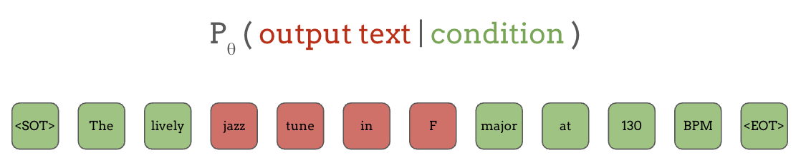
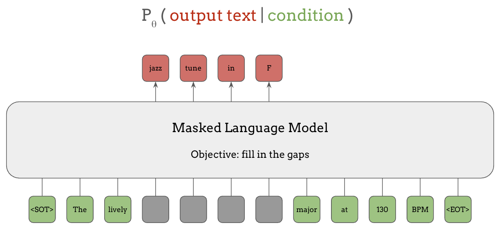
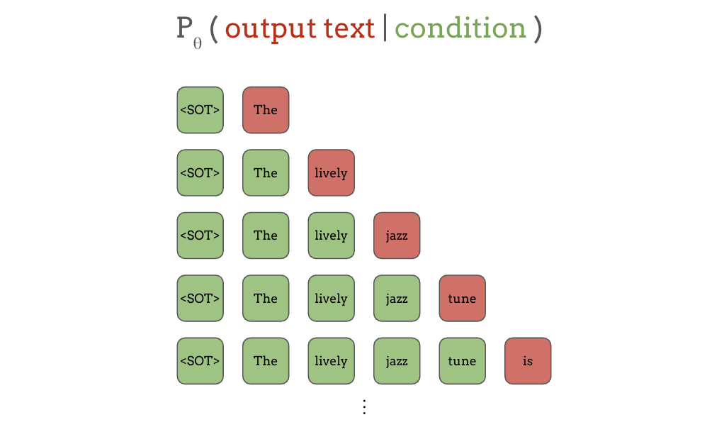
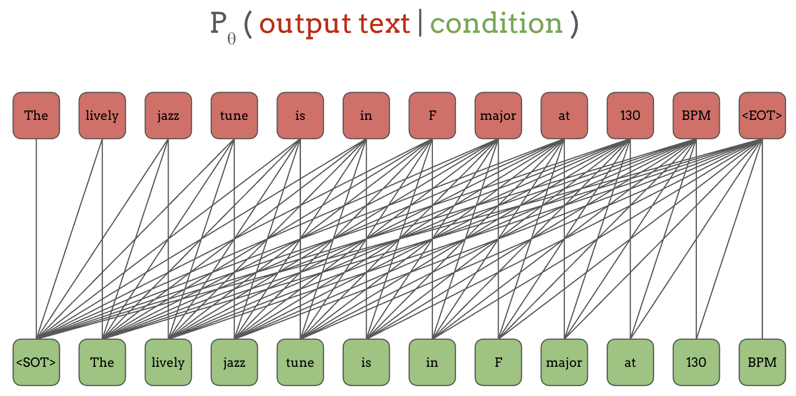
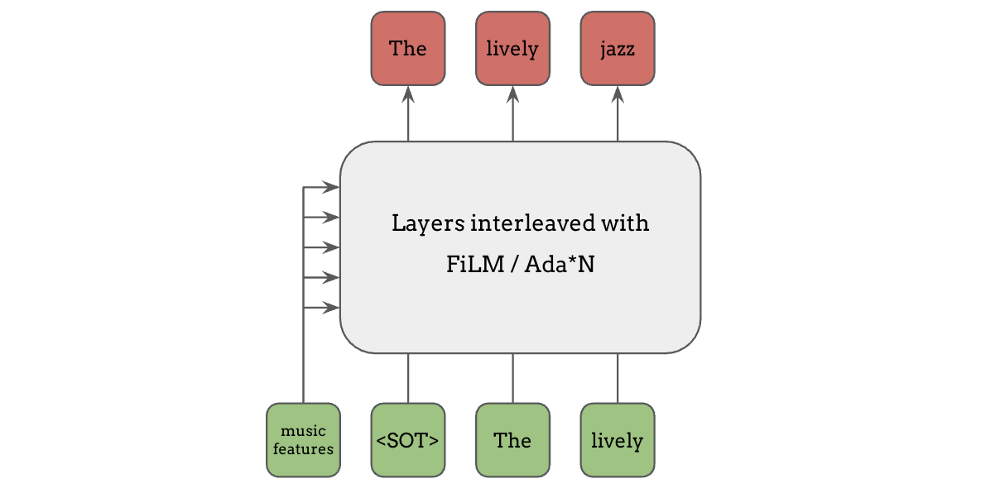
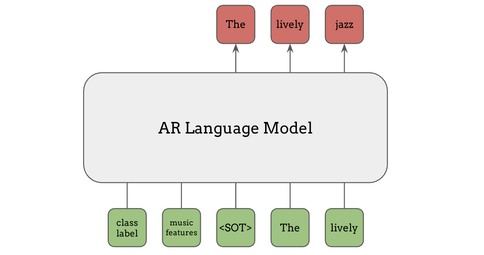
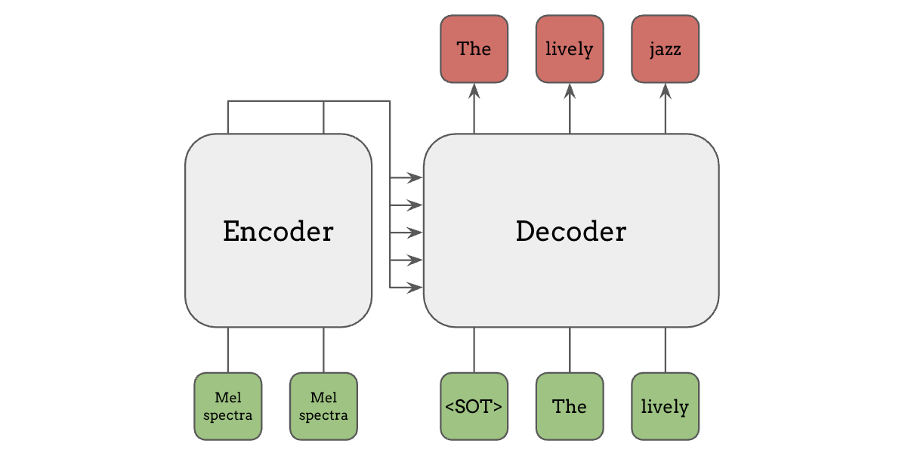

# 框架

在上一节中，我们从最一般的意义上定义了语言模型。
在实践中，要实现和使用语言模型，还需要了解更多的细节。
在本节中，我们将介绍处理语言模型的基础知识和标准实践，重点关注使用神经网络的现代语言模型。

### 表示：文本作为 Token 序列

首先，为了在文本上定义概率分布，我们需要一种方式来表示我们需要计算概率的文本。
最直接的方式是将文本视为一个单词序列：

由于语言中的单词数量应该是有限的，我们可以为每个单词分配一个类别标签，这样就可以在每个位置上对所有可能的单词定义一个分类概率分布。
然而在实践中，词汇量并不是固定的，因此历史上我们使用特殊的 `Unknown` token 来表示语料库中罕见或未见过的单词。更近期的标准做法是使用子词分词（subword tokenization），它将不常见的单词映射为多个子词组件，使用 **Byte Pair Encoding (BPE)** 或 **SentencePiece** 等技术。在这种方案中，像 `unforgettable` 这样的复杂单词可以被分解为三个 token：`un`、`forget` 和 `table`。

这个过程称为 **tokenization**（分词），它可以将任意文本编码为整数或 token 序列。这些 token 就是语言模型使用分类分布来训练预测的对象。
此外，在语言建模中，通常会使用一些特殊 token，它们不映射到单词或子词，而是具有特殊用途，比如标记句子的开头和结尾，如上图中的 `<SOT>` 和 `<EOT>`。

### 语言模型的实现

既然我们已经介绍了文本如何被表示为 token 序列，那么让我们看看语言模型具体是如何预测这些 token 的。
虽然有多种方式可以实现这一点，但有两类方法是最广泛使用的。

##### Masked Language Model（掩码语言模型）

第一种是 Masked Language Modeling (MLM)。在掩码语言模型中，输出文本是如下图红色方块所示的 token 子序列，而条件是该片段周围的 token，即绿色方块。
因此，模型学习的是根据句子中的上下文信息来填空，就像英语考试中的完形填空一样。

具体来说，在像 BERT 这样的掩码语言模型中，输入是表示句子的 token 序列，
如下方底行所示，其中模型正在预测的 token 片段上施加了掩码（灰色方块），
而模型的输出是被掩码片段中的所有 token，如顶行红色所示。

以这种方式训练的 BERT 模型不仅可以用于填空，还可以将其学到的知识迁移到许多其他任务中，我们将在下一节中看到。

BERT 及类似模型（如 RoBERTa）在发布时取得了巨大的成功，
但近年来，下一类语言模型变得更加具有影响力。

##### Autoregressive Language Model（自回归语言模型）

另一种主要的语言模型是自回归（autoregressive, AR）语言模型，其中模型根据所有之前的 token 来预测下一个 token。
同样地，绿色方块是条件，红色方块是输出：

首先，当只给出"start of text"时，模型需要预测下一个词"The"，当给出了文本开头和第一个词"the"时，模型预测下一个词"lively"，以此类推。

虽然预测下一个 token 看起来是一个非常简单的任务，只能以过去的 token 为条件，而不能像掩码语言模型那样看到未来的 token，
但这种简单的方法在从大量无标注数据中学习各种任务方面被证明是极其有效的。
这部分归功于训练这种下一个词预测任务时可以实现大规模并行化。

让我们稍微重新排列绿色输入和红色输出：

连接红色和绿色 token 的线表示条件关系。例如，第一个输出 token "The"以第一个输入 token "&lt;SOT&gt;"为条件，第二个输出 token "lively"以它所连接的前两个绿色 token "&lt;SOT&gt;" 和 "The"为条件，以此类推。
注意底行的输入 token 和顶行的输出 token 是相同的，只是偏移了一个位置。

虽然这些连线看起来过于复杂，但像 RNN 或带有因果掩码的 Transformer 这样的自回归架构可以确保某个输出 token 的预测只依赖于当前和过去的位置。
因此，通过在输入和相同但偏移一个位置的输出上进行训练，它实际上是在所有输出 token 及其对应的上下文上进行多任务训练。

相比之下，前面的 BERT 示例每次只预测一小部分 token，这限制了它能学到多少（即受监督的任务数量有多少），尽管它能看到未来的 token。

##### 条件输入

在上面的内容中，我们介绍了语言模型实现中的"输出文本"部分。那么条件输入呢？

当条件是文本时，它们可以像输出文本一样被表示为 token 序列。
但条件不一定非得是文本，也不需要构成任何概率分布！它们可以是连续特征，比如梅尔频谱图或学习到的特征。
基本上，条件信息如何输入到语言模型中，我们可以有非常大的灵活性。

###### 自适应调制/归一化

假设我们想让语言模型以某些特征为条件，一种常见的方式是根据条件输入来调整网络中的隐藏层或归一化层，例如 FiLM、Adaptive Instance Normalization、Adaptive Layer Normalization 等。这些方法非常有效，因为条件信息可以影响网络中每一层的计算。

###### 通道拼接

另一种方式是在输入的通道维度上拼接条件信息，这是一种更简单且计算成本更低的方法，但仍然可以非常有效。当我们已经知道输入 token 与特征是对齐的时候，这种方法特别有用。在这种情况下，我们可以为每个 token 提供具体匹配的特征，而不是将相同的特征广播给所有 token。

以上两种条件输入方法并非语言模型特有，也适用于其他类型的神经网络，例如条件 GAN。

###### 前缀条件

在语言模型和 Transformer 的背景下，前缀条件（prefix conditioning）是另一种常见的条件输入方法。类别标签或音乐特征等条件信息可以作为额外的 token 放在主输入之前馈送给语言模型，如图中绿色部分所示。与文本 token 不同，这些信息不必是离散整数，任何连续特征都可以在此使用，只需投影到与 token embedding 相同的维度即可。

###### Encoder-Decoder Attention（编码器-解码器注意力，即 Cross Attention）

最后，encoder-decoder attention（编码器-解码器注意力），也称为 cross attention（交叉注意力），是一种更灵活的条件输入方法。其中使用一个独立的编码器模型来计算条件输入的特征（如梅尔频谱图），然后这些特征在解码器的注意力机制中被使用。
这种编码器-解码器架构正是原始 Transformer 论文"Attention is All You Need"中使用的架构，也被 T5 和 Whisper 等模型所采用。

### 语言模型作为通用框架

在本节中，我们介绍了语言模型是什么，以及条件输入和输出 token 是如何连接的。
输入基本上可以是任何东西，只要我们能将输出表示为离散 token 序列，
语言模型就可以为几乎任何机器学习问题提供一个简单的通用框架：

本教程中介绍的大部分研究进展都是对这一框架的适配或扩展。
在下一节中，我们将从这一框架的一些局限性出发，介绍语言模型的各种应用和扩展。
